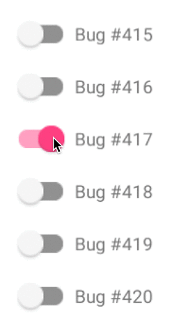

 <!-- .element style="max-height:600px"-->


# @eamodeorubio <!-- .element: style="color: yellow;text-transform: none" -->

<a href="https://www.contentful.com/" rel="nofollow" target="_blank"></a>


# BDD vs. TDD vs. TDD vs. TDD <!-- .element style="color: yellow;text-transform: none"-->


# Before we start ...


# SafeBlog <!-- .element style="text-transform: full-width" -->


> A safe place for sensitive people where you can start
> or join a safe blog community in which everybody
> thinks the same and is safe from exposure to disturbing ideas.


## Posting in SafeBlog


### Let's hire some <span style="color: yellow">Productive</span> developers!


# BDD ?


## Bravery Driven Development

Everybody has done it


## Advantages

* Just ship it!
* Time to market is key
* Agile/Lean start up certified
* Powered by <span style="color: red">YAGNI</span><sup style="font-size: 70%">&copy;</sup>


## Let's code & ship it


## 3 Sprints later


## The Vegan incident

* A bug disabled review process for communities whose DB id was divisible by 13.
* The "MeatEater" community DB id is 28561  <!-- .element: class="fragment" data-fragment-index="1" -->
* A vegan troll infiltrated <!-- .element: class="fragment" data-fragment-index="2" -->
* CEO & CTO & CPO find out in the newspaper <!-- .element: class="fragment" data-fragment-index="3" -->


## <span style="color:red">Bugs</span> undetected

* How long was hurting the company?
* What change introduced the bug?
* Where is the bug?


## Cost of fixing the <span style="color:red">Bugs</span>

* Exponential with time
* It already did hurt the company
* No incentive for code readability


## <span style="color:red">ZERO</span> learning

* What went wrong?
* Are we building the right features?
* No regression


### Let's hire some kick-ass <span style="color: yellow;text-transform:none">ProdEngs</span>!

 <!-- .element: style="width: 800px" -->


# TDD ?


## Telemetry Driven Design

#### _(a.k.a. Observability)_
#### _(a.k.a. Test & Debug in production !)_


## Modern infrastructure & microservices madness


## Telemetry


## Alerts <!-- .element style="color:red" -->
#### (asserting in production)

* Health check based
* Threshold based
* Trend based


## Distributed tracing
#### _(Debugging in production)_


## Metrics first


## Health check
#### (is it up?)

* Ping: Am I responsive?
* Can I talk with my Dependencies?


## System Metrics
#### (does it behaves as expected?)

* Common to all services
* Why is the service failing?
  * A bug?
  * Lack of resources?
  * Some dependency failing?


## System Metrics
#### (examples)

* For each service and its dependencies
  * %99 Response time
  * % failures
* Memory & CPU consumption


## KPIs <!-- .element style="text-transform: none" -->
#### (Are the users behaving as we want to?)

* Company or Team/Product specific
* Proxy for business value


## KPIs <!-- .element style="text-transform: none" -->
#### (examples)

* % Post passing review
* % Good citizens
* Blocked posts


## The Vegan incident

* <span style="color:red">`Too many blocked posts {community=28561}`</span> alert
* Rollback within the hour
  * CEO & CTO & CPO didn't even notice
  * Low impact: only 0.1% "MeatEater"s needed psych. attention


## Is it better?

* How long was hurting the company? Minutes
* Where is the bug? In a specific service
* Cost of mitigation? Rollback


## Learnings

* Failure modes:
  1. Runbooks
  2. Automated Remediation
* Feature business value (using KPIs)


## Other advantages

* No need for E2E tests!
* Promotes a mature infrastructure
* It catches not only bugs but also outages


## Easy to sell

* Common framework/libs
* Nice tools
* Shared system metrics
* Executive seduced by KPIs


## Not so good

* More complex infrastructure
* Still expensive to fix the bug
* Microservices? What about <span style="color: red">YAGNI</span><sup style="font-size: 70%">&copy;</sup>?


## Does it help fixing bugs?

* No incentive for code readability
* Can I change the code easily without adding more bugs?


## No, it doesn't !!! <!-- .element: style="color:red" -->




### Let's hire some <span style="color: yellow;text-transform:none">Clean Coders</span>!

 <!-- .element: style="width: 800px" -->


# TDD (again) ?


## Test Driven Development


## Disclaimer

* Not testing first? -> No TDD
* No refactor? -> No TDD
* Only a few success scenarios? -> Waste!


## Passing <span style="color: green">tests</span>

I'm confident code behaves as I (mis)understood it should behave


## Failing <span style="color: red">tests</span>

* Regression (maybe)
* Code is wrong
* Test is wrong
* Everything is wrong
* Surfaces a misunderstanding or problem


## Flaky <span class="flaky">tests</span>

You're doing it wrong! Look for help!


## Testing SafeBlog

```Gherkin
Feature: Approving blog posts

Background:
  Given that "user 1" is a user for "EatMeater" community
  And that "post X" has been submitted by "user 1"

Scenario: Basic success
  Given that "Super" is allowed to review posts
        in the "EatMeater" community
  When "Super" approves "post X"
  Then "post X" will be "accepted"
```


## And so on...

```Gherkin
Scenario Outline: Already reviewed
  Given that "post X" has been "<already_reviewed_state>"
  When "Super" approves "post X"
  Then "post X" will be "<already_reviewed_state>"
  Examples:
  | already_reviewed_state |
  | accepted               |
  | rejected               |
Scenario: Not authorised
  Given that "Super" is not allowed to review posts
        in the "EatMeater" community
  When "Super" approves "post X"
  Then "post X" will be "submitted"
  And "Super" will get an "authorization" error message
```


## non-domain logic tests?
#### (low business value)

* The shape of the result and inputs
* Fine grained interaction between objects
* Code you need because of the framework
* Code you need because of the monads
* Code you need because async


## The Vegan incident

* Nobody tested the "ID is multiple of 13" scenario!
* Fortunately we were doing Telemetry Driven Development


## So why bother with <span class="flaky">TDD</span>?


### Nice secondary effects

* Better domain understanding
* Faster feedback (no need to go to production)
* Drives creating maintainable code
* Confidence in changing the code


## Not so good

* No proof that production is bug free
* More code (5:1?)


## As difficult to learn as Kung-fu

* How and when to refactor
* Is it DRY/SOLID/etc...?
* Testing the right scenarios


### Let's hire some <span style="color: yellow">Computer Scientists</span>!

 <!-- .element style="font-size: 50%;margin-bottom:0"-->

http://adit.io/posts/2013-06-10-three-useful-monads.html <!-- .element style="font-size: 50%;margin-top:0"-->


# Yet another TDD !!


## Type Driven Development
#### _(May the compiler be with you)_


## Typing SafeBlog
#### <span style="text-transform:none">A Type for Post</span>

```typescript
type ID = string
type User = ???
type PostState = 'Submitted' | 'Accepted' | 'Rejected'
type Post = {
  id: ID,
  author: User,
  status: PostState,
  reviewer: User | undefined
}
```


## Typing SafeBlog
#### <span style="text-transform:none">More Precise Post Type</span>

```typescript
type SubmittedPost = {
  id: ID,
  author: User
}
type ReviewResult = 'Accepted' | 'Rejected'
type ReviewedPost = {
  id: ID,
  author: User,
  reviewResult: ReviewResult,
  reviewer: User
}
type Post = SubmittedPost | ReviewedPost
```


## Typing SafeBlog
#### <span style="text-transform:none">DRY Post Type</span>

```typescript
type SubmittedPost = {
  id: ID,
  author: User
}
type Review = {
  result: ReviewResult,
  author: User
}
type ReviewedPost = SubmittedPost & { review: Review }
type Post = SubmittedPost | ReviewedPost
```


## Typing SafeBlog
#### <span style="text-transform:none">A Type for the review use case</span>

```typescript
// Redux reducers everywhere
type ReviewPost = {
  currentState: Post,
  event: Review
} -> Post
```


## Typing SafeBlog
#### <span style="text-transform:none">The real world</span>

```typescript
type ReviewPostRequest = {
  postId: string,
  reviewResult: string,
  reviewerId: string
}

type ReviewPostRequestHandler = ReviewPostRequest -> string
```


## Typing SafeBlog
#### <span style="text-transform:none">Parsing, fetching & serialising</span>

```typescript
type ParseID = string -> (ID | Error)
type ParseReview = string -> (Review | Error)
type FetchUser = ID -> (User | undefined)
type FetchPost = ID -> (Post | undefined)
type SerialiseID = ID -> string
type SerialisePost = User -> string
```


## Typing SafeBlog
#### <span style="text-transform:none">DRY</span>

```typescript
type Option<T> = T | undefined
type Try<T> = T | Error
type Parse<T> = string -> Try<T>
type Serialiser<T> =  T -> string
type Fetch<T> = ID -> Option<T>
type Reducer<S, E> = {
  currentState: S,
  event: E
} -> S
```


## Typing SafeBlog
#### <span style="text-transform:none">Dependency Injection</span>

```typescript
type DoReviewUseCase = {
    parsers: { id: Parser<ID>, review: Parser<Review> },
    serialisers: { id: Serialiser<ID>, review: Serialiser<Review> },
    fetchers: { user: Fetch<User>, post: Fetch<Post> },
    reducer: Reducer<Post, Review>
  } -> ReviewPostRequestHandler
```


## The Vegan incident

* IDs multiple of 13? How do I type that!
* Fortunately we were doing Telemetry Driven Development


## Pros

* Removes a lot of tests!
* Can give proof for certain class of bugs
* Even earlier and quicker feedback loop!
* Still promoting clean code and domain logic understanding
* Easy to sell


## Warning <!-- .element: style="color: yellow;" -->

* Slow compiler
* Cryptic error messages
* Advanced type systems are not easy to learn


## Type the following

```javascript
const list = [1, true];
const r = [1, true].push('hi!');
```


```scala
type Foldr[Value, F <: Fold[Any, Value], I <: Value] <: Value
```


```scala
trait Fold[-Elem, Value] {
   type Apply[N <: Elem, Acc <: Value] <: Value
   def apply[N <: Elem, Acc <: Value](n: N, acc: Acc): Apply[N, Acc]
}
```


```scala
sealed trait HList {
   type Foldr[Value, F <: Fold[Any, Value], I <: Value] <: Value
   def foldr[Value, F <: Fold[Any, Value], I <: Value](f: F, i: I): Foldr[Value, F, I]

   type Foldl[Value, F <: Fold[Any, Value], I <: Value] <: Value
   def foldl[Value, F <: Fold[Any, Value], I <: Value](f: F, i: I): Foldl[Value, F, I]
}
```


```scala
sealed class HNil extends HList {
   type Foldl[Value, F <: Fold[Any, Value], I <: Value] = I
   def foldl[Value, F <: Fold[Any, Value], I <: Value](f: F, i: I) = i

   type Foldr[Value, F <: Fold[Any, Value], I <: Value] = I
   def foldr[Value, F <: Fold[Any, Value], I <: Value](f: F, i: I) = i
}
```


```scala
final case class HCons[H, T <: HList](head : H, tail : T) extends HList {
   type Foldr[Value, F <: Fold[Any, Value], I <: Value] =
      F#Apply[H, tail.Foldr[Value, F, I]]

   def foldr[Value, F <: Fold[Any, Value], I <: Value](f: F, i: I): Foldr[Value, F, I] =
      f(head, tail.foldr[Value, F, I](f, i) )

   type Foldl[Value, F <: Fold[Any, Value], I <: Value] =
      tail.Foldl[Value, F, F#Apply[H, I]]

   def foldl[Value, F <: Fold[Any, Value], I <: Value](f: F, i: I): Foldl[Value, F, I] =
      tail.foldl[Value, F, F#Apply[H,I]](f, f(head, i))
}
```


## Who test the types?


# Conclusion


# No bug free system is possible <!-- .element: style="color:red"-->


# Do TTTD !


# EXTRA


# GOING CRAZY WITH TYPES


## Type level programming
#### _Reducing types_

```typescript
type AppendDependency<D<_>, R, E> = R & {
  [$lowercase<$nameof<E>>]: D<E>
}

type Dependencies<F<_>, Types...> = $reduce<
  Types,
  AppendDependency<F>,
  Unit
>

type Fetchers<Entities...> = Dependencies<Fetcher, Entities>

type Parsers<Values...> = Dependencies<Parser, Values>
```


## Type level programming
#### _Mapping Types (Templates)_

```typescript
type Request<EventRep, E...> = {
  event: EventRep,
  [$map<E, $name, $lower, $concat<"Id">>]: string
}

type UseCase<S, E, Entities...> = {
  fetchers: Fetchers<Entities>,
  parsers: Parsers<ID, E>,
  reducer: Reducer<S, E>
} -> Request<string, Entities> -> S

type DoReviewUseCase = UseCase<Post, Review, User, Post>
```


## Who test the types?

* Advanced type system are prolog like languages
* Type definitions are programs run by the compiler
  * Literal &amp; types are inputs to the program
  * Readability? Type Level clean code?
  * Slow type level programs
  * Infinite loops
  * Type level bugs
